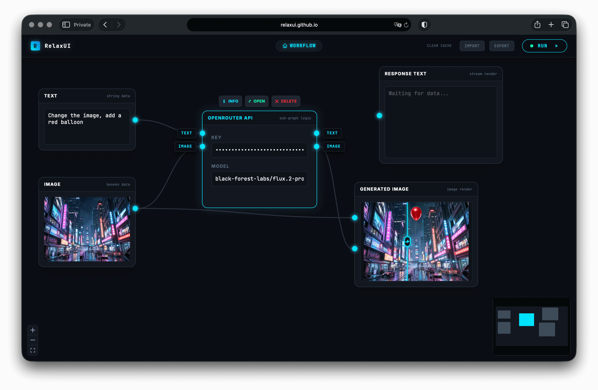

# RelaxUI

**Browser-based visual node workflow editor for AI/ML inference with Transformers.js**



RelaxUI is a fully client-side, node-based workflow builder that lets you design and execute AI/ML pipelines directly in the browser. It combines a visual dataflow editor powered by React Flow with in-browser model inference via Transformers.js v4 -- no server required.

## Features

- Visual node-based workflow editor with drag-and-drop
- **Resizable nodes** — drag the bottom-right corner to expand any node
- In-browser AI inference via Transformers.js (WebGPU/WASM)
- **Rich output visualizations** — bar charts, highlighted NER spans, bounding box overlays, side-by-side comparison, tensor info, and more (auto-detected from pipeline results)
- **Fullscreen image viewer** — enlarge images with bounding boxes and compare sliders
- **Copy output** — one-click copy button on Output Text nodes
- **Workflow Registry** — 40+ ready-made workflows for every pipeline task, model class, and batch processing scenario
- Import workflows from local file, URL, or the built-in registry
- 24 pre-built pipeline macros (NLP, Vision, Audio, Multimodal)
- 20 model class macros for advanced use cases (all integration-tested)
- Streaming support for text generation and API calls
- Macro system for creating reusable sub-workflows
- **Undo/Redo** (Ctrl+Z / Ctrl+Shift+Z) and **Copy/Paste** (Ctrl+C / Ctrl+V) for nodes
- **Batch processing** with progress tracking, folder input with auto-categorization (images/audio/video/text), and multi-format download (JSON/CSV)
- **Model size estimation** with color-coded badges and hardware compatibility hints (including tokenizer/processor nodes)
- **Audio playback** — listen to audio files directly in Audio Input nodes
- **Execution time tracking** per node
- Auto-save to localStorage
- Export workflows as JSON (Ctrl+S)
- **Mobile-responsive header** — adapts to small screens
- Dark theme with CSS custom property design tokens
- MiniMap toggle (positioned to avoid overlap with zoom controls)

## Keyboard Shortcuts

| Shortcut     | Action                |
| ------------ | --------------------- |
| Ctrl+Z       | Undo                  |
| Ctrl+Shift+Z | Redo                  |
| Ctrl+C       | Copy selected nodes   |
| Ctrl+V       | Paste nodes           |
| Ctrl+S       | Export workflow       |
| Ctrl+Enter   | Run workflow          |
| Delete       | Delete selected nodes |
| Escape       | Close modals/menus    |

## Quick Start

```bash
# Install dependencies
bun install

# Start development server (hot reload)
bun run dev

# Build for production
bun run build

# Start production server
bun start

# Run model size checks (queries HuggingFace API)
bun run test:sizes

# Run integration tests (downloads models, runs inference)
bun run test:models
```

Open [http://localhost:3000](http://localhost:3000) in your browser.

## Architecture

```
src/
├── App.tsx                          Entry point (ReactFlowProvider wrapper)
├── types.ts                         Shared TypeScript interfaces
├── index.css                        CSS design tokens & Tailwind import
├── assets/                          Static files (favicons, icons, manifest)
├── config/                          Data-driven registries
│   ├── defaults.ts                  Centralized runtime constants (device, delays, etc.)
│   ├── nodeDimensions.ts            Node size/title definitions
│   ├── nodeInfo.ts                  Node descriptions and I/O specs
│   ├── pipelineRegistry.ts          24 pipeline task definitions (with visualization hints)
│   ├── modelClassRegistry.ts        20 model class definitions (with postProcessCategory)
│   ├── generationDefaults.ts        Generation parameters schema
│   └── workflowRegistry.ts          40+ ready-made workflow definitions
├── engine/                          Execution engine
│   ├── GraphRunner.ts               Core graph execution with streaming
│   ├── nodeExecutors.ts             Per-type executor dispatch
│   └── transformersExecutor.ts      Transformers.js integration (with result envelopes)
├── context/
│   └── RuntimeContext.ts            React context for global state
├── hooks/                           Custom React hooks
│   ├── useFlowState.ts              Node/edge state, auto-save, CRUD, breadcrumbs
│   ├── useGraphRunner.ts            Execution state, display data, timing
│   ├── useUndoRedo.ts               History stack with undo/redo
│   ├── useCopyPaste.ts              Node copy/paste with macro support
│   └── useKeyboardShortcuts.ts      Global keyboard shortcut handler
├── components/                      Shared UI components
│   ├── FlowEditor.tsx               Main flow wrapper (hooks composition + canvas)
│   ├── TopBar.tsx                   Header with breadcrumbs, actions, undo/redo, run
│   ├── FullscreenModal.tsx          Fullscreen image/compare overlay
│   ├── ImportDialog.tsx             Import dialog (file / URL / registry + model sizes)
│   ├── ContextMenu/                 Searchable hierarchical context menu
│   ├── LabeledHandle.tsx            Handle with hover label
│   ├── CustomAnimatedEdge.tsx       Animated edge with activity indicator
│   ├── ImageCompareSlider.tsx       Before/after image comparison
│   ├── InfoModal.tsx                Node info/rename modal
│   ├── ModelLoadingIndicator.tsx    Model download progress widget
│   ├── ModelSizeBadge.tsx           Color-coded model size with hardware hints
│   ├── DynamicParamEditor.tsx       Auto-generated parameter controls
│   └── visualizations/             Rich output visualization components
│       ├── VisualizationRenderer.tsx Router (auto-detects data shape)
│       ├── BarChart.tsx             Horizontal confidence bars
│       ├── HighlightedText.tsx      NER entity-highlighted spans
│       ├── HighlightedAnswer.tsx    QA answer span in context
│       ├── SideBySide.tsx           Two-column text comparison
│       ├── BoundingBoxOverlay.tsx   Canvas bounding boxes on images
│       ├── SegmentationOverlay.tsx  Segment labels with color legend
│       ├── TensorInfo.tsx           Shape, dtype, sample values
│       ├── TranscriptDisplay.tsx    Timestamped ASR output
│       └── ImageCaption.tsx         Image thumbnail + caption
├── nodes/                           Node components
│   ├── BaseNode.tsx                 Shared node chrome (header, handles, exec time)
│   ├── registry.ts                  Node type registry & handle definitions
│   ├── core/                        Core node types
│   │   ├── MediaInputNode.tsx       Unified image/audio input (FILE/URL toggle)
│   │   ├── OutputTextNode.tsx       Rich visualization output (auto-selects renderer)
│   │   ├── OutputImageNode.tsx      Image display with annotation overlay support
│   │   ├── BatchIteratorNode.tsx    Batch iteration with progress bar
│   │   ├── DownloadDataNode.tsx     Multi-format export (JSON/CSV)
│   │   └── ...                      Other core nodes
│   └── transformers/                Transformers.js node types
│       ├── CompanionLoaderNode.tsx  Unified tokenizer/processor loader
│       ├── PipelineNode.tsx         Pipeline with model size badge
│       ├── ModelLoaderNode.tsx      Model loader with size badge
│       └── ...                      Other Transformers nodes
├── macros/                          Pre-built macro factories
│   ├── macroFactory.ts              Unified PREBUILT_MACROS export
│   ├── openRouter.ts                OpenRouter API macro
│   ├── pipelineMacroFactory.ts      Auto-generates 24 pipeline macros
│   └── modelClassMacroFactory.ts    Auto-generates 19+ model class macros
└── utils/
    ├── generateId.ts                Unique ID generator
    └── modelRegistry.ts             HuggingFace model size estimator & cache manager
```

## Rich Output Visualizations

Pipeline results are automatically rendered with task-appropriate visualizations instead of raw JSON:

| Visualization      | Used By                                                                                                                                                              | Description                                        |
| ------------------ | -------------------------------------------------------------------------------------------------------------------------------------------------------------------- | -------------------------------------------------- |
| Bar Chart          | text-classification, image-classification, fill-mask, zero-shot-classification, audio-classification, zero-shot-image-classification, zero-shot-audio-classification | Horizontal confidence bars sorted by score         |
| Highlighted Text   | token-classification                                                                                                                                                 | NER entities with colored spans and type legend    |
| Highlighted Answer | question-answering, document-question-answering                                                                                                                      | Answer span highlighted in context with confidence |
| Side-by-Side       | summarization, translation                                                                                                                                           | Original vs. result text in two columns            |
| Bounding Boxes     | object-detection, zero-shot-object-detection                                                                                                                         | Canvas-drawn boxes with labels on source image     |
| Segmentation       | image-segmentation                                                                                                                                                   | Segment labels with color legend                   |
| Tensor Info        | feature-extraction, image-feature-extraction                                                                                                                         | Shape, dtype, element count, sample values         |
| Transcript         | automatic-speech-recognition                                                                                                                                         | Timestamped text segments                          |
| Image Caption      | image-to-text                                                                                                                                                        | Source image thumbnail with generated caption      |

The `VisualizationRenderer` auto-detects data shapes when metadata is absent, maintaining backward compatibility with any data piped into an OutputText node.

## Node Types

### Core Nodes

| Node            | Type                                       | Description                                                                    |
| --------------- | ------------------------------------------ | ------------------------------------------------------------------------------ |
| Media Input     | `inputImage` / `audioInput` / `videoInput` | Unified image/audio/video input with FILE/URL toggle                           |
| Input Text      | `inputText`                                | Provides a static string value                                                 |
| Output Text     | `outputText`                               | Rich visualization output with auto-detection                                  |
| Output Image    | `outputImage`                              | Image display with compare slider + annotation overlay                         |
| Audio Output    | `audioOutput`                              | Plays back audio data                                                          |
| Custom Script   | `customScript`                             | Executes JavaScript with dynamic I/O ports                                     |
| HTTP Request    | `httpRequest`                              | Fetch API with SSE streaming support                                           |
| JSON Path       | `jsonPath`                                 | Extracts values via dot notation                                               |
| Macro Node      | `macroNode`                                | Container for nested sub-workflows                                             |
| Batch Iterator  | `batchIterator`                            | Iterate over array items with progress tracking                                |
| Delay           | `delay`                                    | Pause execution for N milliseconds                                             |
| List Aggregator | `listAggregator`                           | Collect streamed items into a single array                                     |
| Folder Input    | `folderInput`                              | Pick folder, auto-categorize files, filtered outputs (images/audio/text/video) |
| Download Data   | `downloadData`                             | Export data as JSON or CSV                                                     |

### Transformers.js Base Nodes

| Node             | Type                                                          | Description                            |
| ---------------- | ------------------------------------------------------------- | -------------------------------------- |
| Pipeline         | `transformersPipeline`                                        | High-level pipeline() API for any task |
| Model Loader     | `transformersModelLoader`                                     | Load any Auto/named model class        |
| Companion Loader | `transformersTokenizerLoader` / `transformersProcessorLoader` | Load AutoTokenizer or AutoProcessor    |
| Generate         | `transformersGenerate`                                        | model.generate() with TextStreamer     |
| Model Call       | `transformersModelCall`                                       | Forward pass for call-only models      |
| Post-Process     | `transformersPostProcessCall`                                 | Category-aware output post-processing  |
| Tokenizer Encode | `transformersTokenizerEncode`                                 | Text to token tensors                  |
| Tokenizer Decode | `transformersTokenizerDecode`                                 | Token IDs to text                      |
| Processor        | `transformersProcessor`                                       | Multimodal input processing            |
| Chat Template    | `transformersChatTemplate`                                    | Format messages for models             |
| Env Config       | `transformersEnvConfig`                                       | Configure environment settings         |
| Gen Config       | `transformersGenerationConfig`                                | Build generation parameter object      |

## Pipeline Macros

Pre-built macros for all 24 Transformers.js pipeline tasks:

### NLP

| Pipeline                 | Default Model                                            | Inputs                   |
| ------------------------ | -------------------------------------------------------- | ------------------------ |
| Text Classification      | `Xenova/distilbert-base-uncased-finetuned-sst-2-english` | text                     |
| Token Classification     | `Xenova/bert-base-NER`                                   | text                     |
| Question Answering       | `Xenova/distilbert-base-cased-distilled-squad`           | question, context        |
| Fill Mask                | `Xenova/bert-base-uncased`                               | text (with [MASK])       |
| Summarization            | `Xenova/distilbart-cnn-6-6`                              | text                     |
| Text Generation          | `onnx-community/Qwen2.5-0.5B-Instruct`                   | text                     |
| Translation              | `Xenova/nllb-200-distilled-600M`                         | text, src_lang, tgt_lang |
| Zero-Shot Classification | `Xenova/mobilebert-uncased-mnli`                         | text, labels             |
| Feature Extraction       | `Xenova/all-MiniLM-L6-v2`                                | text                     |

### Vision

| Pipeline                 | Default Model                       | Inputs |
| ------------------------ | ----------------------------------- | ------ |
| Image Classification     | `Xenova/vit-base-patch16-224`       | image  |
| Object Detection         | `Xenova/detr-resnet-50`             | image  |
| Image Segmentation       | `Xenova/detr-resnet-50-panoptic`    | image  |
| Depth Estimation         | `Xenova/depth-anything-small-hf`    | image  |
| Background Removal       | `Xenova/modnet`                     | image  |
| Image-to-Image           | `Xenova/swin2SR-classical-sr-x2-64` | image  |
| Image Feature Extraction | `Xenova/vit-base-patch16-224-in21k` | image  |

### Audio

| Pipeline             | Default Model                                                  | Inputs |
| -------------------- | -------------------------------------------------------------- | ------ |
| Speech Recognition   | `Xenova/whisper-tiny.en`                                       | audio  |
| Audio Classification | `Xenova/wav2vec2-large-xlsr-53-gender-recognition-librispeech` | audio  |
| Text-to-Speech       | `Xenova/mms-tts-eng`                                           | text   |

### Multimodal

| Pipeline                       | Default Model                        | Inputs          |
| ------------------------------ | ------------------------------------ | --------------- |
| Image-to-Text                  | `Xenova/vit-gpt2-image-captioning`   | image           |
| Document QA                    | `Xenova/donut-base-finetuned-docvqa` | image, question |
| Zero-Shot Image Classification | `Xenova/clip-vit-base-patch32`       | image, labels   |
| Zero-Shot Object Detection     | `Xenova/owlvit-base-patch16`         | image, labels   |
| Zero-Shot Audio Classification | `Xenova/clap-htsat-unfused`          | audio, labels   |

## Model Class Macros

Pre-built macros for direct model class usage:

| Category        | Classes                                                                                            |
| --------------- | -------------------------------------------------------------------------------------------------- |
| Base            | AutoModel                                                                                          |
| Text Generation | AutoModelForCausalLM, AutoModelForSeq2SeqLM, AutoModelForMaskedLM                                  |
| Classification  | AutoModelForSequenceClassification, AutoModelForTokenClassification, AutoModelForQuestionAnswering |
| Vision          | AutoModelForImageClassification, AutoModelForObjectDetection, AutoModelForImageSegmentation        |
|                 | AutoModelForSemanticSegmentation, AutoModelForUniversalSegmentation, AutoModelForMaskGeneration    |
| Audio           | AutoModelForSpeechSeq2Seq, AutoModelForTextToSpectrogram, AutoModelForTextToWaveform               |
| Vision-Language | AutoModelForVision2Seq, Qwen3_5ForConditionalGeneration, Florence2ForConditionalGeneration         |

## Workflow Registry

Click **IMPORT > REGISTRY** to browse ready-made workflows. Each is pre-configured with sample data and default models -- load and run immediately. Model sizes are shown with color-coded badges (green < 100MB, yellow < 500MB, red > 500MB).

### Pipeline Workflows (22)

One workflow per pipeline task (text-classification, object-detection, speech recognition, etc.) -- each wires up the appropriate input nodes, a Pipeline node with the default model, and output nodes. Vision detection/segmentation workflows include an OutputImage node with annotation overlays.

### Batch Processing Workflows (3)

Pre-built batch processing pipelines with progress tracking:

| Workflow                  | Description                             |
| ------------------------- | --------------------------------------- |
| Batch Image Captioning    | Caption multiple images from a folder   |
| Batch Text Classification | Classify multiple text items            |
| Batch Background Removal  | Remove backgrounds from multiple images |

### Model Class Workflows (19)

Complex multi-node workflows that use individual Transformers.js nodes (ModelLoader, TokenizerLoader, ProcessorLoader, Generate/ModelCall, PostProcess, Decode, etc.). Generate-capable models use the Generate node; call-only models use ModelCall + PostProcess nodes.

**Generate-mode workflows:**

| Workflow                    | Model Class                       | Default Model                     |
| --------------------------- | --------------------------------- | --------------------------------- |
| Causal LM (GPT-2)           | AutoModelForCausalLM              | Xenova/gpt2                       |
| Seq2Seq LM (Flan-T5)        | AutoModelForSeq2SeqLM             | Xenova/flan-t5-small              |
| Speech-to-Text (Whisper)    | AutoModelForSpeechSeq2Seq         | Xenova/whisper-tiny.en            |
| Image Captioning (ViT-GPT2) | AutoModelForVision2Seq            | Xenova/vit-gpt2-image-captioning  |
| Florence-2                  | Florence2ForConditionalGeneration | onnx-community/Florence-2-base-ft |
| Qwen 3.5 (0.8B ONNX)        | Qwen3_5ForConditionalGeneration   | onnx-community/Qwen3.5-0.8B-ONNX  |
| TTS Spectrogram (SpeechT5)  | AutoModelForTextToSpectrogram     | Xenova/speecht5_tts               |

**Call-mode workflows (forward pass + post-processing):**

| Workflow                   | Model Class                        | Default Model                                          |
| -------------------------- | ---------------------------------- | ------------------------------------------------------ |
| Masked LM (BERT)           | AutoModelForMaskedLM               | Xenova/bert-base-uncased                               |
| Base Model (Features)      | AutoModel                          | Xenova/bert-base-uncased                               |
| Sequence Classification    | AutoModelForSequenceClassification | Xenova/distilbert-base-uncased-finetuned-sst-2-english |
| Token Classification (NER) | AutoModelForTokenClassification    | Xenova/bert-base-NER                                   |
| Question Answering         | AutoModelForQuestionAnswering      | Xenova/distilbert-base-cased-distilled-squad           |
| Image Classification (ViT) | AutoModelForImageClassification    | Xenova/vit-base-patch16-224                            |
| Object Detection (DETR)    | AutoModelForObjectDetection        | Xenova/detr-resnet-50                                  |
| Image Segmentation         | AutoModelForImageSegmentation      | Xenova/detr-resnet-50-panoptic                         |
| Semantic Segmentation      | AutoModelForSemanticSegmentation   | Xenova/segformer-b0-finetuned-ade-512-512              |
| Universal Segmentation     | AutoModelForUniversalSegmentation  | onnx-community/maskformer-swin-small-ade               |
| Mask Generation (SAM)      | AutoModelForMaskGeneration         | Xenova/slimsam-77-uniform                              |
| TTS Waveform (MMS)         | AutoModelForTextToWaveform         | Xenova/mms-tts-eng                                     |

Device auto-detection: WebGPU when available, WASM fallback. The Qwen 3.5 workflow uses per-module quantization (`q4` text / `fp16` vision encoder) and requires WebGPU.

### Import Options

- **Local File** -- upload a `.json` workflow from disk
- **URL** -- fetch a workflow JSON from any URL
- **Registry** -- browse and search built-in workflows by category (with model size estimates)

## CSS Design Tokens

Colors are defined as CSS custom properties in `src/index.css`, making it easy to theme:

```css
:root {
  --relax-bg-primary: #0b0e14;
  --relax-bg-elevated: #131820;
  --relax-border: #1f2630;
  --relax-border-hover: #2a323d;
  --relax-border-active: #3f4b59;
  --relax-text-muted: #5a6b7c;
  --relax-text-default: #a0aec0;
  --relax-text-bright: #ffffff;
  --relax-accent: #00e5ff;
  --relax-success: #00ffaa;
  --relax-error: #ef4444;
}
```

## Configuration

### Generation Parameters

All generation parameters are configurable through the Generate node or Generation Config node:

| Parameter              | Type    | Default | Range     |
| ---------------------- | ------- | ------- | --------- |
| `max_new_tokens`       | number  | 128     | 1 - 4096  |
| `temperature`          | number  | 1.0     | 0.0 - 2.0 |
| `top_p`                | number  | 1.0     | 0.0 - 1.0 |
| `top_k`                | number  | 50      | 0 - 500   |
| `do_sample`            | boolean | false   | -         |
| `min_p`                | number  | 0.0     | 0.0 - 1.0 |
| `repetition_penalty`   | number  | 1.0     | 1.0 - 2.0 |
| `presence_penalty`     | number  | 0.0     | 0.0 - 2.0 |
| `no_repeat_ngram_size` | number  | 0       | 0 - 10    |

### Device & Quantization

| Option       | Values                              | Description                                                                     |
| ------------ | ----------------------------------- | ------------------------------------------------------------------------------- |
| `device`     | `wasm`, `webgpu`, `cpu`             | Hardware acceleration backend (auto-detects WebGPU with WASM fallback)          |
| `dtype`      | `fp32`, `fp16`, `q8`, `q4`, `q4f16` | Quantization precision                                                          |
| Custom dtype | JSON object                         | Per-module quantization (e.g., `{"embed_tokens":"q4","vision_encoder":"fp16"}`) |

### Adding New Parameters

The settings system is registry-driven. To add a new generation parameter:

```typescript
// In src/config/generationDefaults.ts
export const GENERATION_PARAMS = {
  // ... existing params
  new_param: {
    type: "number",
    default: 0,
    min: 0,
    max: 100,
    step: 1,
    label: "New Param",
  },
};
```

The UI auto-generates the appropriate control. No other code changes needed.

## Testing

All 20 model classes have been integration-tested with real model downloads and inference runs:

```bash
# Check all default model sizes (flags models over 1 GB)
bun run test:sizes

# Full integration test — loads models, runs inference, verifies outputs
bun run tests/integration-test.ts
```

The integration test covers:

- All 20 model classes from `modelClassRegistry.ts` (21 test cases covering both `call` and `generate` modes)
- Actual model downloads from HuggingFace Hub
- Forward pass verification for call-only models (output keys + tensor shapes)
- Generate + decode verification for generate-capable models
- Special handling for Whisper (audio), SAM (point prompts), SpeechT5 (vocoder), Florence-2 (multimodal)

## Tech Stack

| Technology                                                               | Version      | Purpose                      |
| ------------------------------------------------------------------------ | ------------ | ---------------------------- |
| [Bun](https://bun.sh)                                                    | 1.3+         | Runtime, bundler, dev server |
| [React](https://react.dev)                                               | 19           | UI framework                 |
| [@xyflow/react](https://reactflow.dev)                                   | 12.10        | Node graph visualization     |
| [@huggingface/transformers](https://huggingface.co/docs/transformers.js) | 4.0.0-next.6 | In-browser ML inference      |
| [Tailwind CSS](https://tailwindcss.com)                                  | 4.1          | Utility-first styling        |
| TypeScript                                                               | ESNext       | Type safety                  |

## License

MIT
